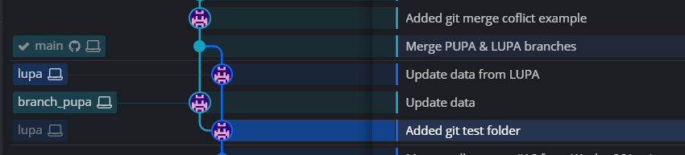

## Пример разрешения конфликта разных веток Git
<hr>

Имеется репозиторий с веткой `main`. В ветке `main` находится файл `git_example.txt` со следующим содержанием:

```
String from "main" branch
```

### 1. Создание конфликта

- [x] Создаем ветку `pupa`:
```
$ git checkout -b branch_pupa
```

- [x] Вносим изменения в файл `git_example.txt`. Теперь он выгляди так:
```
String from "main" branch
String from "pupa" branch
```

- [x] Добавляем изменения и делаем коммит:
```
$ git add .
$ git commit -am "Update data"
```

- [x] Возвращаемся в ветку `main`. Файл `git_example.txt` в ней по-прежнему выглядит так: 
```
String from "main" branch
```

- [x] Создаем ветку `lupa`:
```
$ git checkout -b lupa
```

- [x] Вносим изменения в файл `git_example.txt`. Теперь он выгляди так:
```
String from "main" branch
String from "lupa" branch
```

- [x] Добавляем изменения и делаем коммит:
```
$ git add .
$ git commit -am "Update data from LUPA"
```

- [x] Возвращаемся в ветку `main`. Файл `git_example.txt` в ней по-прежнему выглядит так: 
```
String from "main" branch
```
<hr>

### 2. Слияние веток

- [x] Сливаем ветку `pupa` в `main`:
```
$ git merge branch_pupa
```

- [x] Получаем сообщение о том, что изменения из ветки `pupa` подтянулись в ветку `main`:
```
Updating 01b48eb..2c71b4f
Fast-forward
 Sergey_Leonidovich/DZ_02/git/git_example.txt | 3 ++-
 1 file changed, 2 insertions(+), 1 deletion(-)
```

- [x] Файл `git_example.txt` в ветке `main` теперь выгляди так:
```
String from "main" branch
String from "pupa" branch
```

- [x] Следом сливаем ветку `lupa` в `main`:
```
$ git merge lupa
```

- [x] Получаем сообщение о наличии конфликта:
```
Auto-merging Sergey_Leonidovich/DZ_02/git/git_example.txt
CONFLICT (content): Merge conflict in Sergey_Leonidovich/DZ_02/git/git_example.txt
Automatic merge failed; fix conflicts and then commit the result.
```

### 3. Разрешение конфликта
- [x] При помощи программы [Meld](https://meldmerge.org/) открываем 'проблемный' файл:

<p align="center">
  
</p>

- [x] Формируем итоговое содержание файла `git_example.txt`. 
В данном случае мы хотим, чтобы присутствовали данные из обеих веток (`pupa` и `lupa`).
Сохраняем полученный результат:

<p align="center">
  
</p>

- [x] Добавляем изменения и делаем коммит:
```
$ git add .
$ git commit -am "Merge PUPA & LUPA branches"
```

- [x] Конфликт разрешен. Обе ветки (`pupa` и `lupa`) 'слиты' в ветку `main`:
<p align="center">
  
</p>
<hr>

В папке [img](git/img) находятся изображения командной строки `git bash`, где выполнялся данный пример.